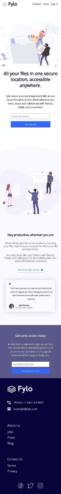
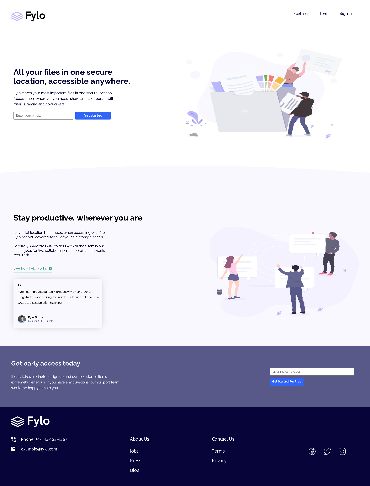

# Frontend Mentor - Fylo landing page with two column layout solution

This is a solution to the [Fylo landing page with two column layout challenge on Frontend Mentor](https://www.frontendmentor.io/challenges/fylo-landing-page-with-two-column-layout-5ca5ef041e82137ec91a50f5). Frontend Mentor challenges help you improve your coding skills by building realistic projects. 

## Table of contents
  - [Screenshot](#screenshot)
  - [Links](#links)
  - [Author](#author)

### Screenshot

### Links

- Live Site URL: [live site URL](https://augustoaguado.github.io/Project-fylo-landing-page/)

## Author

- GitHub - [AugustoAguado](https://github.com/AugustoAguado)

- Linkedin -[augusto-aguado](https://www.linkedin.com/in/augusto-aguado/)

